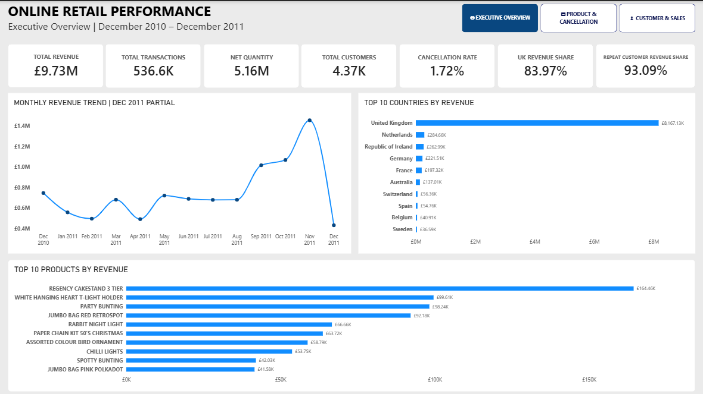

# Online Retail Sales & Customer Analytics

### End-to-End Data Analytics Case Study

**Tools:** Microsoft Excel | MySQL | Power BI  
**Dataset:** UCI Online Retail Dataset  
**Analysis Period:** December 2010 – December 2011

---

## 📊 Project Overview

This project analyses transactional data from a UK-based online retailer to understand sales performance, customer behaviour, product performance, cancellation activity and geographic revenue distribution.

The project follows an end-to-end data analytics workflow using **Microsoft Excel for data preparation and validation, MySQL for structured business analysis, and Power BI for data modelling, visualisation and business intelligence reporting.**

The objective was to transform raw transactional data into reliable insights that could support business decision-making.

## 📊 Power BI Dashboard

The final dashboard brings the analysis together in three pages. It gives a clear view of sales performance, product performance, cancellations, customer behaviour and sales patterns.

### Executive Overview



[View the full Power BI dashboard](powerbi/Online_Retail_Dashboard.pbix)

---

## 🔎 Key Findings

- **The UK is the main market:** 83.97% of total revenue came from the United Kingdom.
- **Repeat customers are highly valuable:** They generated 93.09% of identifiable positive-sales revenue.
- **Customer retention is strong:** 65.57% of customers with positive purchases were repeat customers.
- **November was the strongest full month:** Revenue reached £1.46M in November 2011.
- **Cancellations had a meaningful financial impact:** Cancellation value was £893,979.73, equal to 9.19% of total revenue value.

---
## 🎯 Business Problem

The retailer had a large volume of transactional data but needed a clearer understanding of its overall business performance.

The analysis focused on six key areas:

- Sales and revenue performance
- Product performance
- Customer purchasing behaviour
- Geographic revenue distribution
- Cancellation activity and financial impact
- Sales behaviour over time

The key challenge was to transform raw transactional data into a reliable analytical dataset and use it to answer meaningful business questions.

---

## 🔍 Business Questions

### Sales Performance
- What is the overall revenue generated?
- How does revenue change over time?
- Which countries generate the most revenue?
- When is sales activity strongest?

### Product Performance
- Which physical products generate the most revenue?
- Which products sell the highest number of units?
- Do the highest-volume products also generate the most revenue?

### Customer Behaviour
- How many customers make repeat purchases?
- How much revenue comes from repeat customers?
- How valuable are repeat customers compared with one-time customers?

### Cancellation Performance
- How many transactions are cancelled?
- What is the financial impact of cancellations?
- Which products or transaction activities contribute most to cancellation value?

---

## 🗂️ Dataset

This project uses the **Online Retail Dataset** from the UCI Machine Learning Repository.

**Source:** [UCI Machine Learning Repository – Online Retail Dataset](https://archive.ics.uci.edu/dataset/352/online+retail)

The original dataset contains transactional records from a UK-based online retailer covering **December 2010 to December 2011**.

### Original Dataset

| Metric | Value |
|---|---:|
| Records | 541,909 |
| Columns | 8 |
| Countries | 38 |
| Analysis Period | Dec 2010 – Dec 2011 |

The original dataset contained several data-quality issues, including duplicate records, missing customer information, blank descriptions, cancellations, negative quantities and unusual financial adjustment records.

These issues were investigated during the cleaning process rather than automatically removed.

---

## 🛠️ Tools & Technologies

| Tool | Purpose |
|---|---|
| **Microsoft Excel** | Data cleaning, preparation, validation and exploratory analysis |
| **MySQL** | Database creation, SQL analysis and business querying |
| **Power BI** | Data modelling, DAX, visualisation and dashboard development |

---

## 🔄 Analytical Workflow

```text
Raw UCI Dataset
       ↓
     Excel
Cleaning & Validation
       ↓
    Clean CSV
       ↓
     MySQL
SQL Analysis
       ↓
 Business Insights
       ↓
    Power BI
Data Model + DAX + Visualisation
       ↓
Business Recommendations
```

# 🧹 Data Preparation & Validation

Microsoft Excel was used as the initial data preparation and validation environment.

### Key cleaning activities

* Inspected the original dataset
* Identified and removed duplicate records
* Standardised column names
* Created transaction classification fields
* Identified cancellation records
* Investigated negative quantities
* Investigated unusual price records
* Calculated transaction line values
* Separated date and time fields
* Validated key business metrics

### Duplicate Removal

The original dataset contained duplicate transaction records.

**5,268 duplicate records were removed**, resulting in:

### **536,641 validated records**

---

## ⚠️ Handling Unusual Transactions

Negative transactions were investigated rather than automatically deleted.

The analysis identified:

* **275,560 cancelled units**
* **206,957 non-cancellation negative units**
* **482,517 negative units in total**

The non-cancellation negative records were retained because they had **£0 financial impact**, preserving the transaction history without distorting revenue.

Unusual negative-price records were also investigated and identified as **Adjust bad debt** transactions. These records were retained rather than altering the underlying financial data.

---

# 🗄️ MySQL Analysis

The cleaned dataset was imported into a dedicated MySQL database:

`online_retail_analysis`

A structured `online_retail` table was created with appropriate data types for transaction IDs, product information, quantities, dates, prices, customers, countries and financial values.

The initial import encountered an issue related to the dataset's UK date format. The issue was resolved by configuring local file loading and importing the cleaned CSV using `LOAD DATA LOCAL INFILE`.

### Final Import

* **536,641 rows imported**
* **0 rows skipped**
* **0 warnings**

---

## SQL Analysis

MySQL was used to perform structured business analysis across:

* Revenue performance
* Monthly revenue
* Product revenue
* Units sold
* Country performance
* Customer revenue
* Repeat versus one-time customers
* Cancellation activity
* Cancellation value drivers
* Average selling price
* Day-of-week performance
* Hourly sales behaviour

---

# 📈 Power BI Dashboard

The validated dataset was imported into Power BI to create an interactive three-page business intelligence dashboard.

## 1. Executive Overview

Provides a high-level view of:

* Revenue
* Transactions
* Net quantity
* Customers
* Cancellation rate
* Country performance
* Monthly revenue
* Top physical products

## 2. Product & Cancellation Performance

Analyses:

* Cancellation value
* Cancellation rate
* Cancelled units
* Product revenue
* Product volume
* Cancellation value drivers
* Monthly cancellation value

## 3. Customer & Sales Behaviour

Analyses:

* Repeat customers
* One-time customers
* Customer revenue
* Average customer value
* Revenue by day of week
* Revenue by hour

---

# 💡 Key Business Insights

| KPI                      |       Result |
| ------------------------ | -----------: |
| **Total Revenue**        |   **£9.73M** |
| **Net Quantity**         |    **5.16M** |
| **Customers**            |    **4,372** |
| **Countries**            |       **38** |
| **Cancellation Rate**    |    **1.72%** |
| **Cancellation Value**   | **£893.98K** |
| **UK Revenue Share**     |   **83.97%** |
| **Repeat Customer Rate** |   **65.58%** |
| **Repeat Revenue Share** |   **93.09%** |

---

## Key Findings

### Repeat customers drive revenue

Repeat customers represented approximately **65.58% of purchasing customers** but generated **93.09% of identifiable positive customer revenue**.

This highlights customer retention as a major commercial opportunity.

### The UK dominates revenue

The United Kingdom generated approximately **£8.17M**, representing **83.97% of total revenue**.

This demonstrates strong domestic performance but also significant geographic concentration.

### Cancellations have a significant financial impact

Only **1.72% of transactions** were cancellations, but their associated value reached approximately **£893.98K**, equivalent to around **9.19% of total revenue**.

This suggests that cancellation frequency alone understates the financial impact.

### Product volume and revenue leaders differ

The highest-revenue physical product was **REGENCY CAKESTAND 3 TIER**, generating **£164,459.49**.

The highest-volume product was **WORLD WAR 2 GLIDERS ASSTD DESIGNS**, with **53,751 units**.

This demonstrates why both revenue and sales volume should be considered when evaluating product performance.

### Sales activity peaks around midday

The strongest revenue hour was **12:00**, generating approximately **£1.36M**.

Sales activity was broadly strongest between **10:00 and 15:00**.

---

# 💼 Business Recommendations

Based on the analysis, the following actions are recommended:

### 1. Strengthen Customer Retention

Develop loyalty, personalised recommendations and re-engagement strategies for repeat and high-value customers.

### 2. Investigate High-Value Cancellations

Prioritise investigation of the largest cancellation value drivers to identify potential operational, fulfilment or financial issues.

### 3. Review High-Cancellation Products

Create an exception list of products with unusually high cancelled-to-sold quantity ratios for further investigation.

### 4. Diversify International Revenue

Maintain the strength of the UK market while selectively developing existing international markets.

### 5. Optimise the Product Portfolio

Evaluate products using revenue, sales volume and cancellation behaviour together.

### 6. Improve Data Completeness

Improve customer identification and product information capture to support more accurate future analysis.

### 7. Develop Recurring Business Reporting

Use the Power BI dashboard as a foundation for ongoing performance monitoring and management reporting.

---

# ✅ Data Quality & Validation

A key part of the project was validating the analytical results across multiple tools.

Core metrics were reconciled across:

**Excel → MySQL → Power BI**

| Metric             |      Final Result |
| ------------------ | ----------------: |
| Records            |       **536,641** |
| Revenue            | **£9,726,006.95** |
| Net Quantity       |     **5,162,502** |
| Customers          |         **4,372** |
| Countries          |            **38** |
| Cancellations      |         **9,251** |
| Cancellation Rate  |         **1.72%** |
| Cancellation Value |   **£893,979.73** |

This cross-tool reconciliation helped ensure that the final dashboard was based on consistent and validated figures.

---

# 🧠 Technical Skills Demonstrated

### Microsoft Excel

* Data cleaning
* Data validation
* Excel formulas
* PivotTables
* Exploratory data analysis
* Data preparation

### MySQL

* Database creation
* Table design
* Data import
* SQL querying
* Aggregation
* Conditional logic
* Business analysis
* Data validation

### Power BI

* Power Query
* Data transformation
* Data modelling
* Relationships
* DAX
* Calculated columns
* Measures
* KPI development
* Data visualisation
* Dashboard design
* Interactive navigation

---


---

# 🏁 Project Outcome

This project transformed a raw transactional dataset into a validated business intelligence solution.

The complete analytical journey was:

**Raw Data → Cleaning → Validation → SQL Analysis → Data Modelling → DAX → Dashboard → Insights → Recommendations**

The project demonstrates the ability to work across the complete data analytics lifecycle and translate transactional data into meaningful business decisions.

---

## Conclusion

The analysis shows that the retailer has a strong revenue base and a highly valuable repeat-customer segment, while also presenting opportunities around cancellation management, product optimisation and geographic diversification.

The strongest strategic opportunities identified are to:

**retain valuable customers, reduce high-value cancellation leakage, optimise the product portfolio and gradually diversify beyond the UK market.**

```


